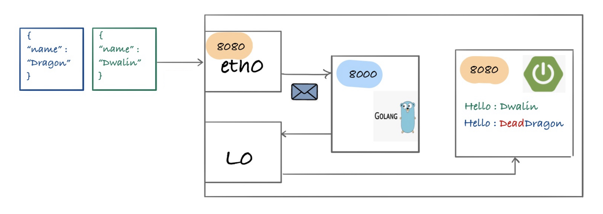

After reading Venil Noronha's tutorial (thanks), I rolled my own service mesh :-)
https://venilnoronha.io/hand-crafting-a-sidecar-proxy-and-demystifying-istio

However I changed two things
- You can configure ingress to route traffic to your service without the need to send requests from inside of the Kubernetes network
- I modified the http requests, depending on my "business logic"

In summary to create a service mesh on Kubernetes you need
1.  An Init Container to allow you to run configuration scripts before you main application container starts
2.  An iptable rule to direct network traffic to your proxy
3.  A proxy where you implment your business logic

My userstory was protecting a village (i.e a SpringBoot rest service) against Dragons

