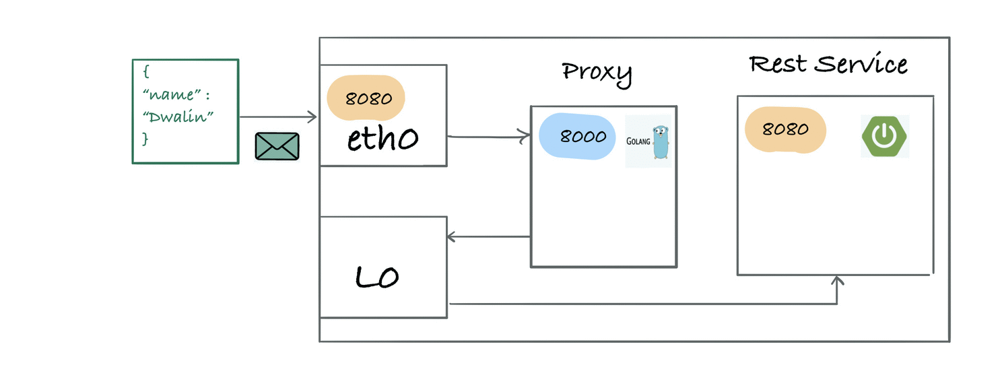
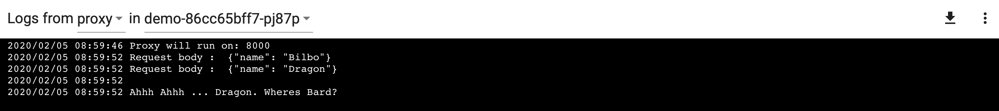
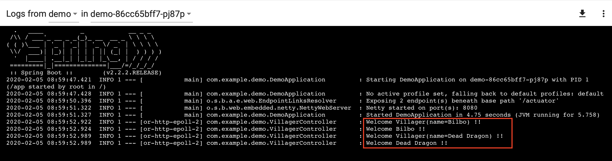

# Sidecar proxies, the heart of a servicemesh


__Background__

After reading Venil Noronha's tutorial [ [1](https://venilnoronha.io/hand-crafting-a-sidecar-proxy-and-demystifying-istio ) ] (thanks!), I rolled my own sidecar proxy :-)

However I changed two things
1. You can configure ingress to route traffic to your service without the need to send requests from inside of the Kubernetes network
2. I modified the http requests, depending on my "business logic"

In summary to create a service mesh on Kubernetes you need
1.  An Init Container to allow you to run configuration scripts before you main application container starts  [ [2](https://sookocheff.com/post/kubernetes/understanding-kubernetes-networking-model/ ) ], [ [3](https://medium.com/@awkwardferny/getting-started-with-kubernetes-ingress-nginx-on-minikube-d75e58f52b6c ) ]
2.  An iptable rule to direct network traffic to your proxy
3.  A proxy where you implment your business logic

__User Story__

My userstory was protecting a village (i.e a SpringBoot rest service) against Dragons \o/




__Quickstart__
```
./run.sh
minikube dashboard
```
__Results__




__References__

[1]: https://venilnoronha.io/hand-crafting-a-sidecar-proxy-and-demystifying-istio 
[2]: https://sookocheff.com/post/kubernetes/understanding-kubernetes-networking-model/ <br/>
[3]: https://medium.com/@awkwardferny/getting-started-with-kubernetes-ingress-nginx-on-minikube-d75e58f52b6c <br/>


__Prerequisites__

[4]: https://kubernetes.io/docs/tasks/tools/install-minikube/ <br/>
[5]: https://golang.org/doc/install) <br/>
[6]: https://adoptopenjdk.net


